Javaでコマンドラインアプリを作る場合は [temp-java-picocli-shadow-graalvm/tree/pure-java](https://github.com/growingspaghetti/temp-java-picocli-shadow-graalvm/tree/pure-java) のページへ

1. ポインタを理解する
2. Goをインストールする
3. VSCodeをインストールする
4. 雛形を作成する
5. アプリのGit情報を埋め込む
6. versionコマンドを作成する
7. catコマンドとwgetコマンドを作成し、配布する

# 1. ポインタを理解する
Gradleもアノテーションもなく、それで付属の標準ライブラリが豊富なので、ポインタを理解できればGoはJavaを使うよりよほど簡単である。https://news.mynavi.jp/article/gogogo-9/

私たちがコンピューターで扱う情報には表と裏がある。表向きの額面はデータの実体そのもののことであり、裏書きされているのはその***ありか***である。

信号が青だという時には、当然青色に光っているということを言っているわけだが、正確に言えば***一つ目のランプ***を光らせたという、場所のことを言っているわけでもある。

十両の金貨を渡すというとき、保管している銀行の支店から小切手を切って渡すというのもある。さらに、その小切手に裏書きして、他の人に再貸し出しするという約束手形の仕組みこそ、信用の重みの発生の源であり、紙幣の成り立ちだとされる。このように、金貨そのものを移動させるわけではなく、***金庫***への到達可能性を受け渡すので結構であることも考えられる。

# 2. Goをインストールする

https://golang.org/doc/install

Windowsであればインストーラーがよしなにやってくれる。

# 3. VSCodeをインストールする

https://code.visualstudio.com/

インストーラーがよしなにやってくれる。

それから

https://marketplace.visualstudio.com/items?itemName=golang.Go

をVSCodeにインストールすれば、やはりよしなにやってくれる。

それから

https://marketplace.visualstudio.com/items?itemName=uloco.theme-bluloco-light

をVSCodeにインストールすれば、表示の綺麗さでもやはりよしなにやってくれる。

# 4. 雛形を作成する
- 以下、一連のdiffはここから見れる: https://github.com/growingspaghetti/temp-go-flag-cli/commits/main

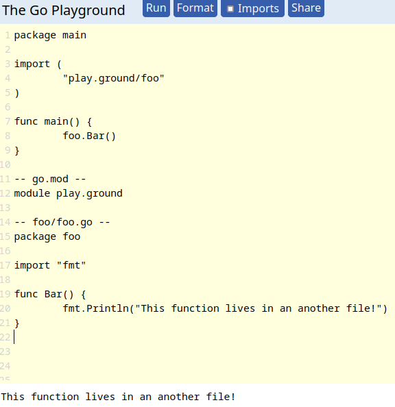

https://play.golang.org/p/rq4J90MxTKJ に書いてある`go.mod`というものなのだが、これを初期化してつくらないとならない。適当にプロジェクトフォルダを作り、そこで`go mod init foo`する。このfooの値、今回はgithubのURLにしたが、本当は基本的に何でもいい。

<pre><font color="#A6E22E"><b>ryoji@ubuntu</b></font>:<font color="#66D9EF"><b>~/dev</b></font>$ mkdir temp-go-flag-cli
<font color="#A6E22E"><b>ryoji@ubuntu</b></font>:<font color="#66D9EF"><b>~/dev</b></font>$ cd temp-go-flag-cli/
<font color="#A6E22E"><b>ryoji@ubuntu</b></font>:<font color="#66D9EF"><b>~/dev/temp-go-flag-cli</b></font>$ go mod init github.com/growingspaghetti/temp-go-flag-cli
go: creating new go.mod: module github.com/growingspaghetti/temp-go-flag-cli</pre>

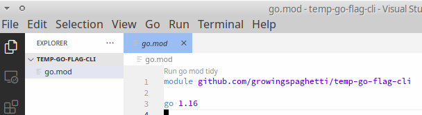

そしたら、VSCodeで、`ファイル > フォルダを開く`すると、写真のようにgo.modファイルだけがある。

```go
package main

import "fmt"

func main() {
	fmt.Println("abc")
}
```
おもむろにmain.goというのを作り、それにこれを書いて、ターミナルで`go run main.go`すると、次の写真になる。

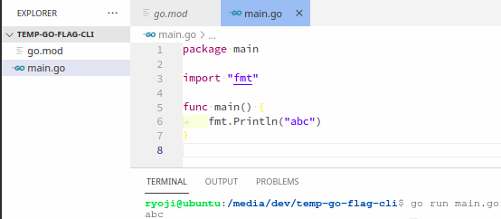

さらに、`go build`すると、それだけで配布可能な実行ファイルができる。

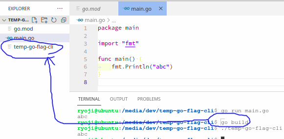

# 5. アプリのGit情報を埋め込む

- https://devlights.hatenablog.com/entry/2021/03/02/110912

Goでは、コンパイル時に`-ldflags`というオプションを利用してこれを埋め込む。Docker化してコンテナに情報を記す方法もあるが、長くなるのでそれはまた別の機会に話したい。

以下の情報を埋め込む。
<pre><font color="#A6E22E"><b>ryoji@ubuntu</b></font>:<font color="#66D9EF"><b>~/dev/temp-go-flag-cli</b></font>$ git rev-list -1 HEAD
e4c22e2734dc81fd172cf21a0b746fc3af9db30c
<font color="#A6E22E"><b>ryoji@ubuntu</b></font>:<font color="#66D9EF"><b>~/dev/temp-go-flag-cli</b></font>$ git name-rev --name-only --tags HEAD
undefined
<font color="#A6E22E"><b>ryoji@ubuntu</b></font>:<font color="#66D9EF"><b>~/dev/temp-go-flag-cli</b></font>$ git tag v0.1.0
<font color="#A6E22E"><b>ryoji@ubuntu</b></font>:<font color="#66D9EF"><b>~/dev/temp-go-flag-cli</b></font>$ git name-rev --name-only --tags HEAD
v0.1.0</pre>

HEADは、履歴の最終端を意味している。

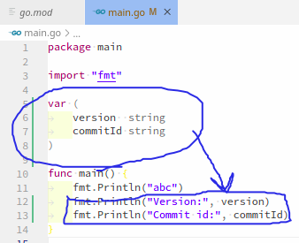

を加え、

<pre><font color="#A6E22E"><b>ryoji@ubuntu</b></font>:<font color="#66D9EF"><b>~/dev/temp-go-flag-cli</b></font>$ version=`git name-rev --name-only --tags HEAD | sed &apos;s/^undefined$//&apos;` &amp;&amp; commit_id=`git rev-list -1 HEAD` &amp;&amp; go build -ldflags &quot;-X main.version=${version} -X main.commitId=${commit_id}&quot;
</pre>

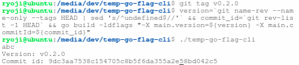

# 6. versionコマンドを作成する

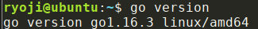

Goの場合には、`-v`とか`--version`とかではなくて、versionで表示させるのが慣例。

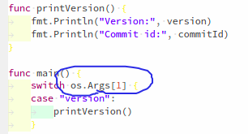

`os.Args`でプログラムに与えられた引数を確認できる。

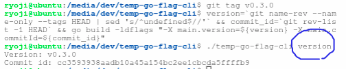

# 7. catコマンドとwgetコマンドを作成し、配布する

https://github.com/growingspaghetti/temp-go-flag-cli/releases/tag/v0.4.0

標準ライブラリ内にあるflagライブラリを利用する。
- https://oohira.github.io/gobyexample-jp/command-line-flags.html
- https://oohira.github.io/gobyexample-jp/command-line-subcommands.html

`cmd.Args()`でcatとかwgetとかサブコマンドの引数を確認できる。

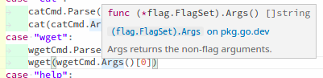

しかし、GoではJavaと違い、Pythonと同じで一見して分かる型ヒントがなく、マウスカーソルをあてないと分からないので、その点コーディングは私には厳しい。

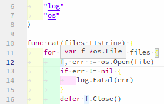

<pre><font color="#A6E22E"><b>ryoji@ubuntu</b></font>:<font color="#66D9EF"><b>~/dev/temp-go-flag-cli</b></font>$ git tag v0.4.0
<font color="#A6E22E"><b>ryoji@ubuntu</b></font>:<font color="#66D9EF"><b>~/dev/temp-go-flag-cli</b></font>$ version=`git name-rev --name-only --tags HEAD | sed &apos;s/^undefined$//&apos;` &amp;&amp; commit_id=`git rev-list -1 HEAD` &amp;&amp; go build -ldflags &quot;-X main.version=${version} -X main.commitId=${commit_id}&quot;
<font color="#A6E22E"><b>ryoji@ubuntu</b></font>:<font color="#66D9EF"><b>~/dev/temp-go-flag-cli</b></font>$ ./temp-go-flag-cli help
Usage:

    app &lt;command&gt; [arguments]

The commands are:

    version     print App version
    help        show this message
    cat         print text files
    wget        download a file from the web
<font color="#A6E22E"><b>ryoji@ubuntu</b></font>:<font color="#66D9EF"><b>~/dev/temp-go-flag-cli</b></font>$ ./temp-go-flag-cli version
Version: v0.4.0
Commit id: 70ad363eef0bc0d857c66004eb6b73274c364b60
<font color="#A6E22E"><b>ryoji@ubuntu</b></font>:<font color="#66D9EF"><b>~/dev/temp-go-flag-cli</b></font>$ ./temp-go-flag-cli cat .gitignore
temp-go-flag-cli
temp-go-flag-cli.exe
<font color="#A6E22E"><b>ryoji@ubuntu</b></font>:<font color="#66D9EF"><b>~/dev/temp-go-flag-cli</b></font>$ ./temp-go-flag-cli wget https://upload.wikimedia.org/wikipedia/commons/thumb/3/35/Leptosia_nina-Kadavoor-2017-05-04-003.jpg/350px-Leptosia_nina-Kadavoor-2017-05-04-003.jpg
</pre>
